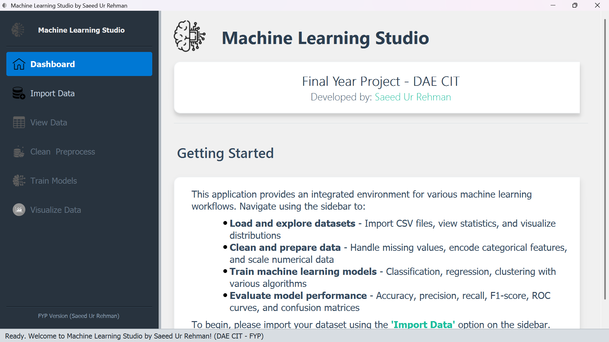

# Machine Learning Studio


An interactive desktop application built with PyQt5 for performing end-to-end regression-based machine learning workflows. This was developed as a Final Year Project (FYP) for the DAE in Computer Information Technology.

**Author:** Saeed Ur Rehman

---

## 📸 Screenshot



---

## ✨ Key Features

This application provides an integrated environment for the entire machine learning pipeline:

* **Interactive Dashboard**: A welcoming start screen with project details and instructions.
* **Asynchronous Data Loading**: Import datasets from `.csv`, `.xlsx`, and `.json` files using a multi-threaded loader that keeps the UI responsive and shows a progress bar.
* **Data Exploration**:
    * View the full dataset in a dynamic, sortable table.
    * Analyze a detailed statistical summary for each column, including metrics like mean, median, standard deviation, and null value counts.
* **Data Preprocessing**: A dedicated module to clean and prepare your data for modeling.
    * Handle missing values using various strategies (mean, median, mode, etc.).
    * Scale numerical features using `StandardScaler`, `MinMaxScaler`, or `RobustScaler`.
    * Remove unnecessary columns.
    * Detect and remove duplicate rows.
* **Model Training & Evaluation**:
    * Train a wide variety of regression models, including Linear Regression, Ridge, Lasso, Decision Trees, Random Forest, XGBoost, SVR, and more.
    * Select features and a target variable through a user-friendly dialog.
    * Configure model-specific hyperparameters directly in the UI.
    * Automatically find the best model using a cross-validation-based "Auto Select" feature.
    * Evaluate model performance with key metrics (R², MSE, RMSE, MAE) and plots for Feature Importance and Actual vs. Predicted values.
* **Model Management**:
    * Compare performance across different training runs in a history table.
    * Save trained models (including the entire processing pipeline) to a file.
    * Load saved models to make new predictions or review performance.
    * Generate and export detailed PDF reports for trained models.
* **Prediction Engine**:
    * Make predictions on single new data instances using an interactive form.
    * Perform batch predictions by loading a file with new data.
* **Dynamic Visualization**: A dedicated module for creating a range of plots to understand your data, such as histograms, scatter plots, correlation matrices, and more.

---

## 🛠️ Built With

This project is built using the following core technologies:

* **GUI Framework:** [PyQt5](https://riverbankcomputing.com/software/pyqt/)
* **Data Manipulation:** [Pandas](https://pandas.pydata.org/) & [NumPy](https://numpy.org/)
* **Machine Learning:** [Scikit-learn](https://scikit-learn.org/), [XGBoost](https://xgboost.ai/), [LightGBM](https://lightgbm.readthedocs.io/)
* **Data Visualization:** [Matplotlib](https://matplotlib.org/) & [Seaborn](https://seaborn.pydata.org/)
* **Model Persistence:** [Joblib](https://joblib.readthedocs.io/)
* **PDF Reporting:** [ReportLab](https://www.reportlab.com/)

---

## 🚀 Getting Started

To get a local copy up and running, follow these simple steps.

### Prerequisites

You need Python 3.8+ and `pip` installed on your system.

### Installation

1.  **Clone the repository:**
    ```sh
    git clone [https://github.com/BINEARY-BEATS/Machine-Learning-Studio.git](https://github.com/BINEARY-BEATS/Machine-Learning-Studio.git)
    ```
2.  **Navigate to the project directory:**
    ```sh
    cd Machine-Learning-Studio
    ```
3.  **(Recommended) Create and activate a virtual environment:**
    ```sh
    # Create the virtual environment
    python -m venv venv

    # Activate on Windows
    venv\Scripts\activate

    # Activate on macOS/Linux
    source venv/bin/activate
    ```
4.  **Install the required packages:**
    *(You will need to create a `requirements.txt` file first. See the "To Do" section below).*
    ```sh
    pip install -r requirements.txt
    ```

---

## 🏃 Usage

Once all the dependencies are installed, you can run the application from the root directory with the following command:

```sh
python main.py